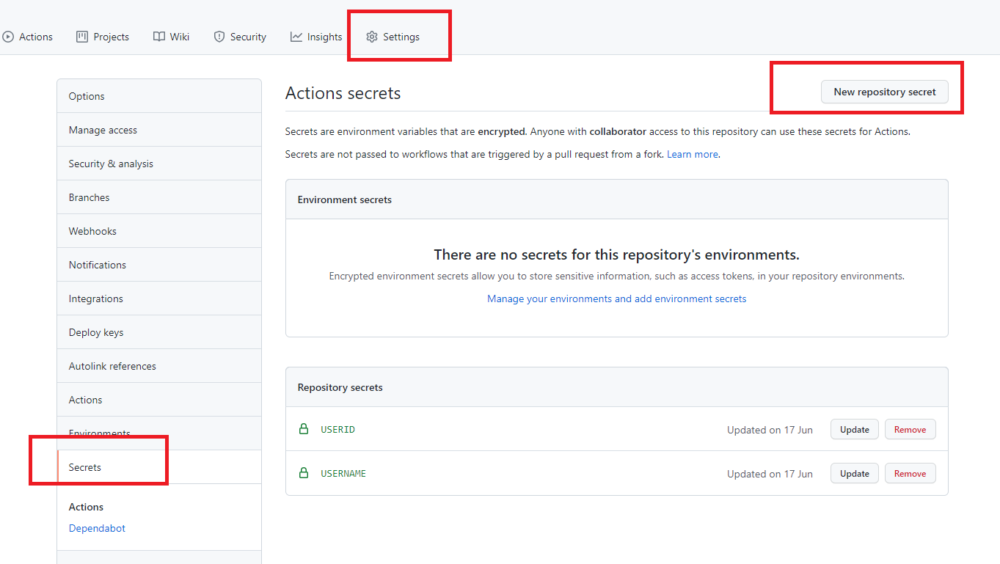

# qndxx-action
用于广西区域的青年大学习的自动打卡
## ~~学习不用等~~

## 使用方法
### 1 fork此项目
### 2 找到路径setting=》secret=》new repository secret
   添加USERID与USERNAME两个key, 对应value为青年大学习的学习编号与姓名  
   
### 3 **激活Actions**  **Important!**  
   进入: Actions 点击 I Understand  
   点击右侧enable workflow // 
     
   